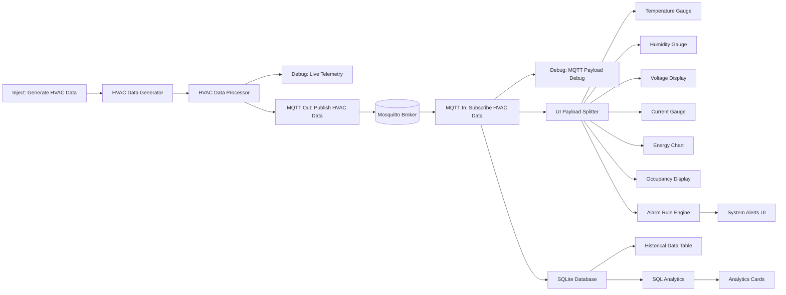

# HVAC and Remote Energy Monitoring System

## Project Overview

This project focuses on designing and implementing an Industrial IoT-based HVAC and remote energy monitoring system using Node-RED, MQTT, and a live dashboard interface. The solution simulates real-world building/environmental telemetry and demonstrates how HVAC and electrical parameters can be monitored remotely in a smart facility setup.

## Objective

The main objective of this project was to create a practical prototype that can:

- Monitor HVAC-related parameters such as temperature and humidity.
- Track electrical system behavior through voltage, current, and energy values.
- Simulate occupancy conditions for building monitoring.
- Visualize live data using an interactive dashboard.
- Trigger status alerts when values cross predefined thresholds.

## Implementation Summary

The following work was implemented as part of the project:

- Developed a Node-RED flow to simulate HVAC and energy telemetry at regular intervals.
- Created a data generator that produces realistic mock sensor values.
- Added a processing layer to validate, timestamp, and standardize the incoming data.
- Published the processed telemetry to an MQTT topic for communication.
- Subscribed to the same topic to receive and distribute data for dashboard visualization.
- Built dashboard widgets such as gauges and status indicators for real-time monitoring.
- Implemented alert logic to represent system health as HEALTHY, WARNING, or CRITICAL.
- Documented the flow structure and project workflow in a reusable format.

## Key Features

- Simulates HVAC telemetry every 5 seconds.
- Monitors temperature, humidity, voltage, current, energy, and occupancy.
- Validates and normalizes sensor values before publishing.
- Uses MQTT communication over the topic hvac/data.
- Displays live UI widgets including gauges, charts, and status panels.
- Supports threshold-based alarm handling for abnormal conditions.
- Includes debug nodes for monitoring telemetry and MQTT payloads.

## System Architecture

The current implementation follows a complete Node-RED telemetry pipeline that starts with simulated sensor generation and ends with MQTT-based data distribution and a live dashboard UI.



### Architecture Notes

- The flow uses an inject node to trigger telemetry every 5 seconds.
- The generator function creates mock values for temperature, humidity, voltage, current, energy, and occupancy.
- The processor validates the payload and adds a timestamp before publishing.
- MQTT is used to transport the processed telemetry from the publisher to the subscriber.
- The UI payload splitter routes the incoming data to separate dashboard components.
- The alarm rule engine evaluates temperature and current thresholds and updates the alert panel with HEALTHY, WARNING, or CRITICAL status.

## Technology Stack

- Node-RED
- MQTT with Mosquitto broker
- Node-RED Dashboard
- JavaScript functions for data generation and processing
- JSON-based flow configuration

## Project Structure

```text
upskillcampus/
|-- README.md
|-- HVACAndRemoteEnergyMonitoringSystem_JASWANTH_USC_UCT.pdf
|-- images/
|   |-- dashboard.png
|   |-- node-red flow.png
|-- node-red/
|   |-- flows.json
```

## How the System Works

1. An inject node triggers telemetry generation at fixed intervals.
2. The generator function creates mock HVAC and electrical data.
3. The processor function adds a timestamp, validates the values, and formats the payload.
4. The formatted data is published to the MQTT topic hvac/data.
5. A subscriber receives the same data and routes it to visualization and alerting nodes.
6. The dashboard displays live readings and highlights abnormal conditions.

## Setup and Run

1. Install Node-RED on your system.
2. Install the Node-RED Dashboard package.
3. Ensure an MQTT broker such as Mosquitto is running locally on port 1883.
4. Import the flow file from the node-red folder into Node-RED.
5. Deploy the flow and open the dashboard UI.

## Project Outcome

This project demonstrates how a smart monitoring prototype can be built using low-cost IoT tools to visualize environmental and energy data in real time. It provides a strong foundation for extending the system to real sensors, cloud connectivity, remote alerts, and predictive maintenance in future iterations.
