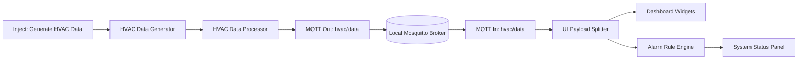

# HVAC and Remote Energy Monitoring System

## Overview

This project is an Industrial IoT simulation built with Node-RED and MQTT for real-time HVAC and energy monitoring. Instead of physical sensors, it generates realistic mock telemetry and visualizes system behavior through a live dashboard.

## Features

- Simulates HVAC telemetry every 5 seconds.
- Monitors temperature, humidity, voltage, current, energy, and occupancy.
- Applies data validation and normalization before publishing.
- Uses MQTT publish/subscribe communication on topic hvac/data.
- Displays live dashboard widgets: gauges, chart, and status text.
- Includes alarm logic with HEALTHY, WARNING, and CRITICAL states.
- Provides debug outputs for telemetry and MQTT payload verification.

## Architecture



## Technology Stack

- Node-RED
- MQTT (Mosquitto broker on localhost:1883)
- Node-RED Dashboard (@flowfuse/node-red-dashboard)
- JSON-based flow configuration

## Project Structure

```text
upskillcampus/
|-- README.md
|-- node-red/
|   |-- flows.json
```

## System Workflow

1. Inject node triggers data generation at fixed intervals.
2. Generator function creates mock HVAC and electrical telemetry.
3. Processor function timestamps, validates, and standardizes payload.
4. Data is published to MQTT topic hvac/data.
5. Subscriber receives the same topic for downstream processing.
6. UI splitter routes values to dedicated dashboard widgets.
7. Alarm engine evaluates thresholds and updates status messages.
